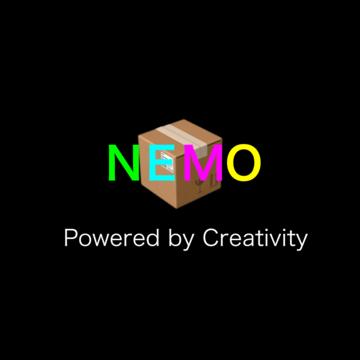

# NEMO

[ [日本語](README.ja.md) ]

※ it's beta for now

A unique game engine for creating visual symbolic games using emoticons and powerful functional language.




## Major Features

- Easy to create games with powerful functional language (PureScript)
- Only emoticons can be used. On the contrary it stimulates your creativity
- Games can be distribute to any device on which web browser runs

### Why PureScript

First, I want to create simple games with functional language.

Haskell ->
It was awesome if I could do everything.
However, it is difficult to run on any devices.

Elm ->
It is good one for easy distribution.
But type classes are not supported.
And it is recommended to follow Elm architecture.

PureScript ->
It has a type class like Haskell.
And it is compiled into Javascript.
So it can be easy to run on any devices with browser!

### Why Only Emoticons

Something restricted stimulates creativity.

I was very inspired by fantasy consoles represented by [PICO-8](https://www.lexaloffle.com/pico-8.php).

They have great limitations on available sprites, sound and some capacities.

On the contrary, these restrictions stimulates creativity and makes game making fun.

Just like this, I think it is interesting to have restrictions that only emoticons can be used against the web platform.

## Play Online

- [NEMO GAMES](https://opyapeus.github.io/nemo/index.html)

You can also add games you made with NEMO here.

If you want, please make issue or PR at Github Pages [Repository](https://github.com/opyapeus/nemo)

## Installation

```sh
bower i purescript-nemo
```

## Getting Started

- [Usage](docs/usage.md)

## Specification

- Language: PureScript
- Monitor Size: 1024x1024
- Emoticon: 1207 unicode emojis
- Color: 16 html base colors
- Map Editor: Raw text (emoji) editing
- Sound Editor: Raw text (emoji) editing
- Input Interface: Keyboard, Touch Screen
- Frame Rate: About 60 FPS
- Working Environment: Browers on any device (It needs some GPU power)

## Input Interface

### Keyboard

```plain
 /¯¯¯\_/¯¯¯\
|  W  |  ↑  |
| A D | ← → |
|  S  |  ↓  |
 \___/¯\___/
 ```

### Touch Screen ※Experimental

For mobile, it is equivalent to keyboard inputs that swiping on the right or left side of the screen.

## Examples

clone this repository first.

install

```sh
npm i
bower i
```

build

```sh
npm run build
npm run build:examples
```

open html (public folder) on browser

```sh
npm run open
```

access with tag (it may need reload)

```url
public/index.html#hello
public/index.html#basic
public/index.html#emodius
```

## Emoticons

- [Supported Emojis](docs/emoji.md)

## Under Developing List

### high

- [x] add debug mode
- [ ] more sound effect support (ex. noise)
- [ ] improve touch screen operation

### middle

- [ ] interpreter which executes code on the web
- [ ] performance tuning
- [ ] iOS sound support

### low

- [ ] emoji parser (adapt to all emoticons)
  
### wait and see

- emoji rotate (45°, 135°, 225°, 315°) problem on canvas
- default emoji presentation [CSS Fonts Module Level 4 - Editor’s Draft, 17 August 2018](https://drafts.csswg.org/css-fonts-4/#font-variant-emoji-prop)

## Documentation

- [Module documentation on Pursuit](https://pursuit.purescript.org/packages/purescript-nemo/)

## Contribution

Since it is beta version, wait for a while.
If you find an improvement point, please give me an issue.
Thank you.

## License

[MIT](LICENSE)

※ About license of emoticons' graphics are owned by each vendor.